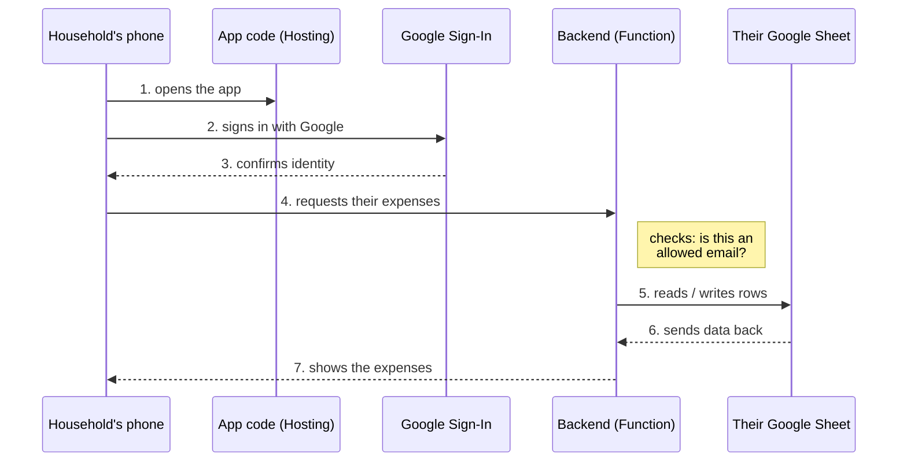
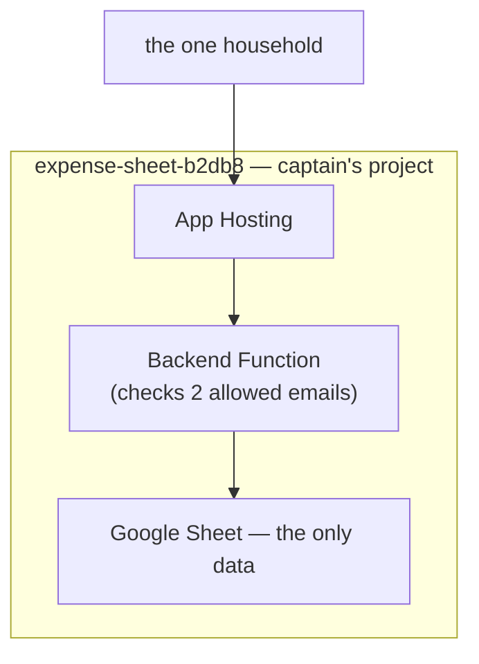
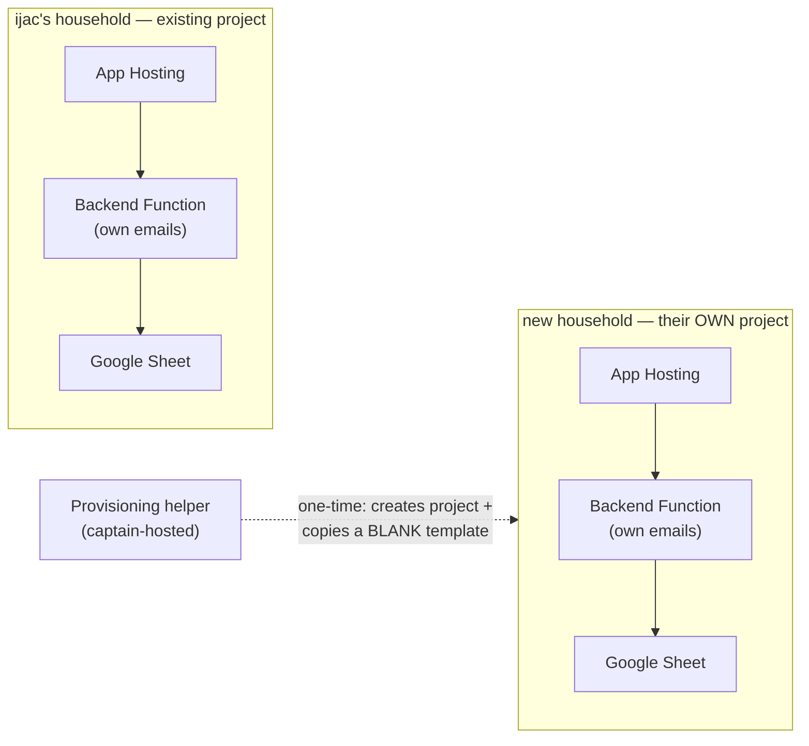

# Household Isolation Architecture — Entity 023

Reviewed 2026-09-15. Backs the ideation revision on `023-product-packaging`: other households can get their own live instance, but nothing of theirs ever passes through infrastructure the captain operates.

**Decision:** Captain will host the provisioning helper — the one-time tool that creates a new household's Firebase project and hands them a blank Sheet template. It never touches any household's live, ongoing data.

Interactive version (same content, with sequence diagrams): https://claude.ai/artifact/RWJ3jfnGX6bAmBEttMcowx

## Parts index

| № | Component | What it actually does | Hardwired today |
|---|---|---|---|
| 1 | Household's phone / browser | The app's screen — where someone opens it and looks at expenses. | — |
| 2 | App code (Hosting) | The screens and buttons themselves. Holds no data — just displays what the backend hands it. | `expense-sheet-b2db8` |
| 3 | Google Sign-In | Confirms who is actually signing in. | 2 named users |
| 4 | Backend (Function) | The only piece that ever touches real data. Checks the sign-in against an allow-list before doing anything, then reads or writes rows on request. | `AUTHORIZED_EMAILS` (2) |
| 5 | Google Sheet | The actual data — every expense, category, and subscription. The only data store; there's no separate database. | `SPREADSHEET_ID` |
| + | Provisioning helper *(new)* | A one-time setup tool that creates a new household's Firebase project and hands them a blank Sheet template. Never runs again after setup — no ongoing connection to anyone's data. | new · captain-hosted |

## How one request actually flows

Unchanged by this redesign — the same shape serves one household today or many households later.

## Today vs. proposed

**Today** — one household, one Firebase project, everything hand-set:

**Proposed** — every household, old or new, in its own sealed project. Nothing connects them; the only new piece is a one-time provisioning step that never touches live data:

Note what's absent: no edge between household A's and household B's subgraphs. The provisioning helper's only edge is a one-time, dashed connection into a new project's creation — never into an existing project's live Sheet.

## Out of scope (decide at spec time)

- Any architecture where captain's infrastructure, backend, or credentials can read/write another household's data, even transiently in passthrough (rules out one shared backend proxying everyone's Sheet reads/writes)
- Monetization or accounts
- Mobile app store distribution
- Exact hosting/provisioning mechanism (one-click? script? manual guide?)
